```{r setup, include = FALSE}
knitr::opts_chunk$set(
  htmltools.dir.version = FALSE,
  message = FALSE,
  warning = FALSE
)

options(width = 80)

library(tidyverse)
library(xaringan)


bootstrap_options <- c("striped", "hover", "condensed")

tableStyle <- function(t,
                       boot_opt = bootstrap_options, 
                       full_width = TRUE,
                       digits = 2) {
  
  t %>%
    mutate_if(is.numeric, round, digits = digits) %>%
    knitr::kable() %>%
    kableExtra::kable_styling(
      bootstrap_options = boot_opt,
      full_width = full_width
    )
}
```

# The Plan

* Intro/Background
* Data Collection
    + Weight Data in CDW
    + SQL Code
    + Height for BMI
* Cleaning Weight Data
    + Algorithms
        + `weightalgos` package
    + Common Research Scenarios
        + Descriptive Statistics
        + Weight as a Predictor
        + Weight Change
        + Weight Trajectories
        + Facility-Level Measures
* Findings & Recommendations
* Questions

---
class: inverse, center, middle

# Intro/Background

---
class: middle

Our work on body weight measurements starts with our literature review published in *Obesity Reviews*,

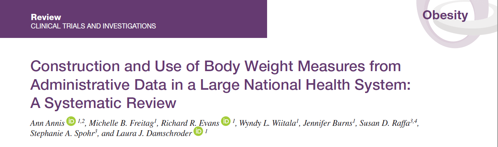

---
class: middle

...and continued in our cyberseminar

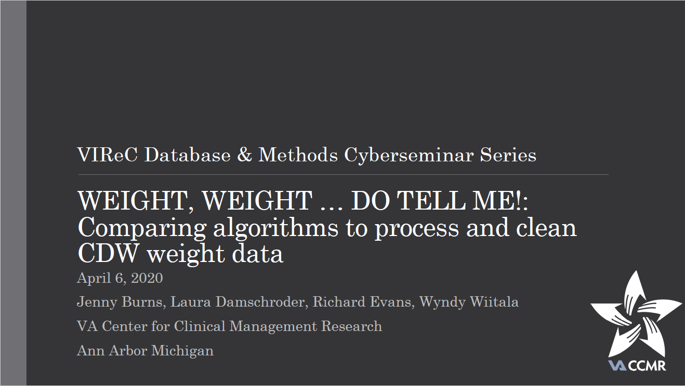

---
class: middle

# Objectives

1. Compare algorithms for extracting and processing clinical weight measures from CDW databases.  

2. Provide guidance and recommendations for choosing algorithms in research and evaluation.

--

More about objectives and motivations later ...

---
class: middle, inverse, center

# Data Collection

---
class: middle

# Weight Measurements

Weight in CDW can be found in `CDWWork.Vital.VitalSign` table

--

Pretend you have some cohort of patients in a temp table `#samp2016`

--

```{r, echo = TRUE, eval = FALSE}
SELECT a.*,
       b.VitalSignTakenDateTime AS WeightDateTime,
       b.VitalResultNumeric AS Weight,
       CAST(CONVERT(VARCHAR(8), b.VitalSignTakenDateTime, 112) AS date) AS WeightDate
    INTO #PCPWeights2016
        FROM #samp2016 AS a
            LEFT JOIN Vital.VitalSign AS b
                ON a.PatientSID = b.PatientSID
            LEFT JOIN Dim.VitalType AS c
                ON b.VitalTypeSID = c.VitalTypeSID
        WHERE c.VitalType LIKE '%weight%'
              AND b.EnteredInErrorFlag IS NULL
-- nrow = 3345553, ncol = 19
```

---
class: middle

If you're collecting a very large sample but only want weights collected in a certain date range, you may run into .red[long running process] issues with SQL Server

--

```{r, echo = TRUE, eval = FALSE}
SELECT *
    INTO #PCPWindowWeights2016
        FROM #PCPWeights2016
        WHERE WeightDateTime >= DATEADD(year, -2, VisitDateTime)
              AND 
              WeightDateTime <= DATEADD(year,  2, VisitDateTime)
-- nrow = 1220985, ncol = 13
```

---
class: middle

<font style="color:#182F53">Weight</font> will often be combined with <font style="color:#F57A4D">Height</font> data to compute <font style="color:#9C3725">BMI</font>.  

--
<br>
<br>
<font style="color:#F57A4D">Height</font> data can be found similar to <font style="color:#182F53">Weight</font>

--

```{r, echo = TRUE, eval = FALSE}
SELECT a.PatientICN,
       a.PatientSID,
       a.VisitDateTime,
       b.VitalSignTakenDateTime AS HeightDateTime,
       b.VitalResultNumeric AS Height,
       CAST(CONVERT(VARCHAR(8), b.VitalSignTakenDateTime, 112) AS date) AS HeightDate
    INTO #Heights
        FROM (
              SELECT DISTINCT PatientICN,
                     PatientSID,
                     VisitDateTime
                FROM NCP_DCEP.Samp.NationalWeightSamples
             ) AS a
            LEFT JOIN Vital.VitalSign AS b
                ON a.PatientSID = b.PatientSID
            LEFT JOIN Dim.VitalType AS c
                ON b.VitalTypeSID = c.VitalTypeSID
        WHERE c.VitalType LIKE '%height%'
              AND b.EnteredInErrorFlag IS NULL
-- nrow = 7338348, ncol = 7
```

---
class: middle

# Pointers

1. Patient <font style="color:#F57A4D">Height</font> is collected less frequently than <font style="color:#182F53">Weight</font>, so it's usually a good idea to *look back* further than you would for <font style="color:#182F53">Weight</font>

--

2. Since I'm only taking `VitalResultNumeric` for both <font style="color:#182F53">Weight</font> and <font style="color:#F57A4D">Height</font>, there won't be any `CHAR` contaminants in the variables. That *usually* leaves only numeric issues that may appear as **outliers**.

---
class: middle, inverse, center

# Cleaning Weight Data

---
class: middle

## Motivations

Weight can vary substantially within patient, may have differing units, and may be subject to data entry errors.

--

No standard for processing and cleaning EHR weight.

--

Researchers are left to develop their own algorithms to define weight, resulting in many different definitions in the published literature.

--

Range from simple cut offs for implausible values to more computationally complex algorithms requiring significant coding and processing capacity, as well as difficulties in replication.

---
class: middle

.content-box-blue[Unknown how resulting weight measures may vary based on how researchers process and
clean the data, and subsequently, **the impact of algorithm choice on results and research findings is unknown.**]

---
class: middle

## Algorithms

From our systematic literature review (Annis A, *et al.* 2020) we identified 39 published studies that used the CDW to define patient weight outcomes.

--

Of the 39 studies, 33 included a weight cleaning algorithm that could be implemented and replicated in the current work.

--

For analytic purposes, we chose 12 algorithms that represent each "type" of approach. 

---
class: middle

### Classification

We divided the 12 algorithms into two conceptual groups:

--

1. Those that include .blue[all weight measurements] during a specified time frame  
2. Those that are .red[time-period specific]

--

.red[Time period specific] algorithms selected "baseline, 6 month, and 12 month" time periods and included weight measurements during specified windows around those dates.

--

.content-box-grey[Note] not all algorithms fit exactly into these groups.

---
class: middle, center

Conceptual Description of Main Exclusions After Applying Each Algorithm

```{r, echo = FALSE, eval = TRUE, out.width = 870, out.height = 466}
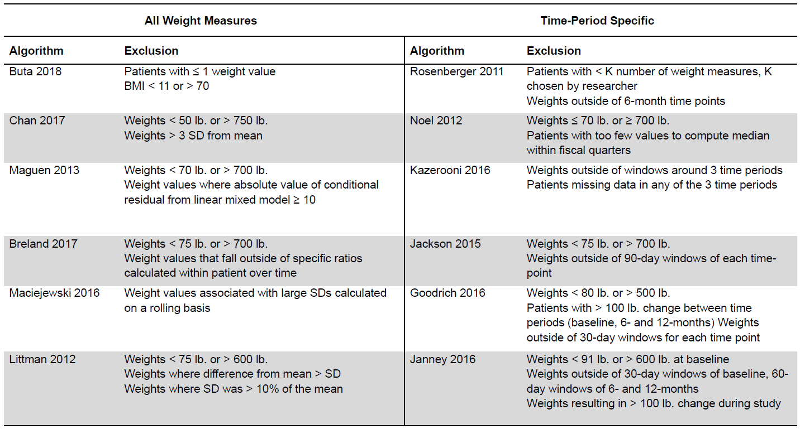
```

---
class: middle

## Translation

Each algorithm was then translated into pseudocode then into **R** code **as best as possible** from the published methods.

---
class: middle
background-image: url("figures/bookdown_logo.png")
background-position: right top

### Bookdown

All code to reproduce our analyses can be found online at [bookdown.org/revans_evans/weight_algorithms_analyses/](https://bookdown.org/revans_evans/weight_algorithms_analyses/)<sup>1</sup>

.footnote[
[1] I've been meaning to switch out *revans_evans* for *CCMRcodes*, but it's a bit involved
]

---
class: middle
background-image: url("figures/GitHub-Mark-120px-plus.png")
background-position: right top

### GitHub

All algorithms can be found on the project Github [github.com/CCMRcodes/WeightAlgorithms](https://github.com/CCMRcodes/WeightAlgorithms).

--

Most are written in , a few in **SAS**<sup>1</sup>

.footnote[
 [1] Maciejewski M., *et al.* 2016 coded in R and SAS thanks to Ted Berkowitz (Theodore.Berkowitz@va.gov)
]

---
class: middle

### `weightalgos` package

--

Main idea behind the package was to make my life easier. Second to that, to aid analysts and researchers in cleaning weight data<sup>1</sup>

.footnote[
 [1] And possibly any continuous data collected in a similar matter to weight (e.g., lab values, clinical score, currency)
]

--

Currently lives in the `CCMRcodes` GitHub

--

I did not submit it to **CRAN** due to some boilerplate warnings but it can be downloaded with

```{r, echo = TRUE, eval = FALSE}
devtools::install_github("CCMRcodes/WeightAlgorithms/weightalgos", build_vignettes = TRUE)
```

---
class: middle

Then view the vignette with

```{r, echo = TRUE, eval = FALSE}
library(weightalgos)

vignette("compare_algorithms")
```

```{r, echo = FALSE, eval = TRUE}
library(weightalgos)
```

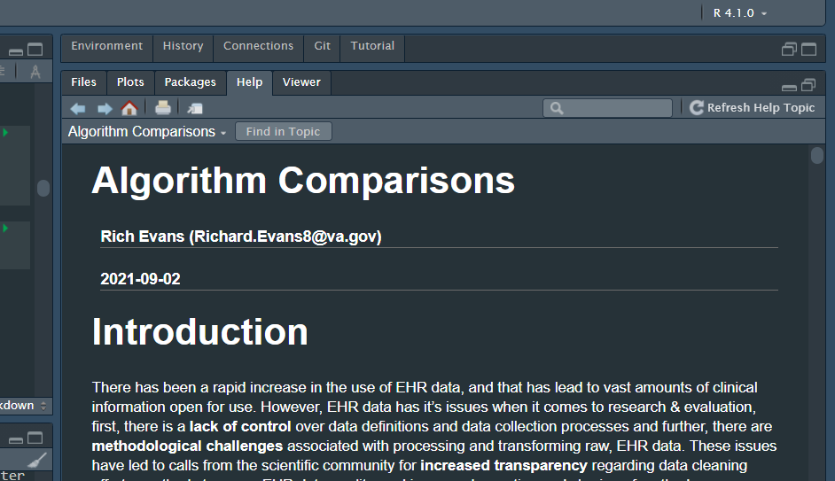

---
class: middle

### Functions in `weightalgos`

#### 12 Main Functions

Each algorithm is named after the first author in each study listed in the table above.

--

```{r}
lsf.str("package:weightalgos")[1:10]
```

--

For example, `buta()`, `breland()`, `chan()`, etc. are the main algorithms, all else are either used internally or elsewhere.

---
class: middle

### Manual Pages

Details and examples for each algorithm/function can be investigated in more detail by visiting the help pages, e.g., `?janney` or `help(janney)`

```{r, echo = TRUE, eval = FALSE}
help("janney")
```

---
class: middle

### Usage and Parameters

Each algorithm differs in how they are used, and in parameterization<sup>1</sup>

--

Parameterization follows the conceptual groups, 

1. Those that include .blue[all weight measurements] during a specified time frame  
2. Those that are .red[time-period specific]

with some exceptions

.footnote[[1] Function Arguments]

---
class: middle

### Example

#### .red[time-period specific]

```{r, echo = TRUE, eval = FALSE}
janney_df <- janney(
  df = samp,
  id = "id",
  measures = "Weight",
  tmeasures = "WeightDate",
  start_point = "VisitDate",
  t = c(0, 183, 365),
  windows = c(30, 60, 60),
  outliers = list(
    LB = c(91, 72, 72),
    UB = c(600, 650, 650)
  )
)
```

> For grouped time series, (e.g., per person) Define time points and collect measurements, optionally applying windows for possible data points for each time point, then removing outliers. Based on work by Janney *et al.* 2016.

--

For an explanation of each argument above, use `help(janney)`

---
class: middle

Before explaining the nuances of the `janney()` function, it will help to have sample data

---
class: middle

# Sample Data

We will run each algorithm on our sample of weights taken from the VA CDW, included in the package as `cdw1000`. For our purposes I will generate outlier weights based on a skew-normal distribution, for 5% of the values.

```{r}
library(tidyverse)   # data management suite
library(data.table)  # used by weightalgos (making explicit)
library(weightalgos)

data(cdw1000)

samp <- cdw1000 %>%
  sample_n(n() * 0.025) %>%     # sample 2.5% of n for lower
  mutate(Weight = sn::rsn(n(), 100, -25, 3)) %>%
  select(id:Weight) %>%
  right_join(cdw1000, by = c("id", "WeightDate")) %>%
  mutate(
    Weight_aug = coalesce(Weight.x, Weight.y),
    outlier = ifelse(!is.na(Weight.x), 1, 0)
  ) %>%
  select(-Weight.x) %>%
  rename(Weight_orig = Weight.y)
```

```{r, echo = FALSE, eval = TRUE}
samp <- samp %>%
  filter(outlier == 0) %>%
  sample_n(n() * 0.025) %>%     # sample 2.5% of n for upper
  mutate(Weight_aug = sn::rsn(n(), 400, 150, 3)) %>%
  select(id, WeightDate, Weight_aug) %>%
  right_join(samp, by = c("id", "WeightDate")) %>%
  mutate(
    Weight_aug = coalesce(Weight_aug.x, Weight_aug.y),
    outlier = ifelse(!is.na(Weight_aug.x), 1, outlier)
  ) %>%
  select(-Weight_aug.x, -Weight_aug.y) %>%
  distinct()
```

---
class: middle

## Simulating Outliers

```{r, echo = FALSE, eval = TRUE, fig.height = 6, fig.width = 10}
or_pu <- c("#631647", "#FF8B0D")

samp %>%
  select(id, Weight_orig, Weight_aug) %>%
  pivot_longer(
    cols = starts_with("Weight"), 
    names_to = "weight_version"
  ) %>%
  mutate(
    weight_version = factor(
      weight_version,
      c("Weight_orig", "Weight_aug"),
      c("Original", "Augmented")
    )
  ) %>%
  ggplot(aes(
    x = value, 
    fill = factor(weight_version),
    color = factor(weight_version)
  )) +
  facet_wrap(vars(weight_version), nrow = 2) +
  geom_density(alpha = 0.5) +
  geom_rug() +
  theme_void(16) +
  scale_fill_manual(values = or_pu) +
  scale_color_manual(values = or_pu) +
  theme(
    legend.position = "none",
    strip.text.x = element_text(margin = margin(0.5, 0, 0.5, 0, "cm"))
  )
```

---
class: middle

### `janney()` Revisited

```{r, echo = TRUE, eval = FALSE}
janney_df <- janney(
  df = samp,
  id = "id",
  measures = "Weight_aug",
  tmeasures = "WeightDate",
  start_point = "VisitDate",
  ...
)
```

Input `df` needs to be *long-form* (multiple rows per record ID)

```{r, echo = FALSE, eval = TRUE}
samp %>%
  select(id, WeightDate, VisitDate, Weight_aug) %>%
  arrange(id, WeightDate) %>%
  head(6) %>%
  tableStyle()
```

---
class: middle

### time-points

```{r, echo = TRUE, eval = FALSE}
janney_df <- janney(
  ...
  t = c(0, 183, 365),
  ...
)
```

With these algorithms (time-period specific), the user must choose the time-point at which to "collect" data

--

> `t`: numeric vector of time points to collect measurements, eg. c(0, 183, 365) for measure collection at t = 0, t = 180 (6 months from t = 0), and t = 365 (1 year from t = 0). Default is c(0, 183, 365) according to Janney *et al.* 2016

---
class: middle

### Windows

```{r, echo = TRUE, eval = FALSE}
janney_df <- janney(
  ...
  windows = c(30, 60, 60),
  ...
)
```

In a cohort collected from EHR data, it is rare to find an exact time-point (`WeightDate`) containing a weight, so researchers use windows around these dates for collection

--

> `windows`: numeric vector of measurement collection windows to use around each time point in `t`. E.g. Janney et al. 2016 use `c(30, 60, 60)` for `t` of `c(0, 18, 365)`, implying that the closest measurement `t = 0` will be collected 30 days prior to and 30 days post start_point. Subsequent measurements will be collected 60 days prior to and 60 days post t0+182.5 days, and t0+365 days.

--

To Clarify,

$$
[0 \pm 30 \ \text{days}], ..., [183 \pm 60 \ \text{days}], ..., [365 \pm 60 \ \text{days}]
$$

---
class: middle

### Outliers

```{r, echo = TRUE, eval = FALSE}
janney_df <- janney(
  ...
  outliers = list(
    LB = c(91, 72, 72),
    UB = c(600, 650, 650)
  )
)
```

Upper and lower bounds of plausible weight values, it is an optional argument.

--

> `outliers`: Object of type list with numeric inputs corresponding to the upper and lower bound for each time entry in parameter `t`. Default is `list(LB = c(91, 72, 72), UB = c(600, 650, 650))` for `t = c(0, 182.56, 365)`, differing between baseline and subsequent measurment collection dates. If not specified then only the subsetting and window functions will be applied.

---
class: middle

### Run Function, check Output

```{r}
janney_df <- janney(
   df = samp,
   id = "id",
   measures = "Weight_aug",
   tmeasures = "WeightDate",
   start_point = "VisitDate"
  )
```

```{r, echo = FALSE, eval = TRUE}
janney_df %>%
  arrange(id, WeightDate) %>%
  head() %>%
  select(id, WeightDate, Weight_aug, dtime:measout) %>%
  tableStyle()
```

---
class: middle

### Example

#### .blue[Include all weight measurements]

```{r, echo = TRUE, eval = FALSE}
maguen_df <- maguen(
  df = samp,
  id = "id",
  measures = "Weight_aug",
  tmeasures = "WeightDate",
  outliers = list(LB = 70, UB = 700),
  variables = c("Age", "Sex"),
  resid_threshold = 10,
  add_internals = FALSE,
  ...
)
```

> For grouped time series, (e.g., per person) `maguen` removes outliers, then models patients' weight trajectories with a linear mixed model with a random slope and intercept, adjusted for age and gender, it then removes measurements where the residual meets a certain threshold. Based on work by Maguen *et al.* 2013

---
class: middle

### No Start-Point

```{r, echo = TRUE, eval = FALSE}
maguen_df <- maguen(
  df = samp,
  id = "id",
  measures = "Weight_aug",
  tmeasures = "WeightDate",
  outliers = list(LB = 70, UB = 700),
  ...
)
```

Same as `janney()`, but no baseline starting point

---
class: middle

### Optional Adjustment Variables

```{r, echo = TRUE, eval = FALSE}
maguen_df <- maguen(
  ...
  variables = c("Age", "Sex"),
  ...
)
```

> `variables`: character vector describing the terms in `df` to include on the RHS of the internal mixed model. E.g., c("Age", "Gender") would generate a model of the form `measures ~ Age + Gender + Time + (1 + Time | id)`.

---
class: middle

### Residual Threshold $|e_i| \ge k$

```{r, echo = TRUE, eval = FALSE}
maguen_df <- maguen(
  ...
  resid_threshold = 10,
  ...
)
```

> `resid_threshold`: single numeric value to be used as a cut off value for the conditional (response) residual for each measurement. Values closer to zero are more conservative.

---
class: middle

### Run Function, check Output

```{r}
maguen_df <- maguen(
  df = samp,
  id = "id",
  measures = "Weight_aug",
  tmeasures = "WeightDate",
  outliers = list(LB = 70, UB = 700),
  variables = c("Age", "Sex"),
  resid_threshold = 15,
  add_internals = TRUE
)
```

```{r, echo = FALSE, eval = TRUE}
maguen_df %>%
  select(id, WeightDate, t, Weight_aug, measout) %>%
  head() %>%
  tableStyle()
```

---
class: middle

### Alternatively Use `all_algos()`

**Run all measurement cleaning algorithms simultaneously**

> `all_algos` runs all 12 algorithms with default settings and outputs a named list with each result. Each algorithm requires a basic set of data: a patient identifier, `id`; the measures to clean, `measures` (e.g., weight, continuous lab data, etc.); a recorded time at which the measure was taken `tmeasures`. Some require an index date, `StartPoint` (Janney *et al.* 2016, Goodrich *et al.* 2016, Jackson *et al.* 2015, Kazerooni & Lim 2016, Rosenberger *et al.* 2011), Maguen *et al.* 2013 adjusts for optional demographic variables (e.g., age, sex). Buta *et al.* 2018 stands out, requiring BMI measurements as the unit of measurement measures. 

Thus, in order to fully utilize this function, `df` needs to have at least `id`, `measures`, `tmeasures`, `StartPoint`, and `BMI`.

```{r, echo = FALSE, eval = TRUE}
all_ls <- all_algos(
  samp, 
  id = "id", 
  measures = "Weight_aug", 
  tmeasures = "WeightDate", 
  start_point = "VisitDate",
  variables = c("Age", "Sex")
)
```

---
class: middle, inverse, center

# Common Research Scenarios

---
class: middle

## Common uses of weight measures in research & evaluation

* **Descriptive**
* As a **Predictor** in studies that seek to adjust for the effect of baseline weight when examining the association between another variable and an outcome
* **Weight Change** in studies examining the effects of an independent variable on patient weight or weight change over time
* Patient **weight Trajectories**
* **Facility Level Effects** in studies examining performance measures across facilities, groups, clusters, etc.

---
class: middle

## Descriptive Statistics

.full-width[.content-box-blue[All algorithms were applied to the data for each of the two cohorts and compared based on descriptive statistics, including the number of measures and patients retained, the mean, standard deviation, median, and range of weight values.]]

--

.full-width[.content-box-blue[For comparison, we also included the descriptives based on the raw, unprocessed weight data during the time frame.]]

---
class: middle, center

### Varying Number of Patients Retained

```{r, echo = FALSE, eval = TRUE, out.height = 453, out.width = 870}
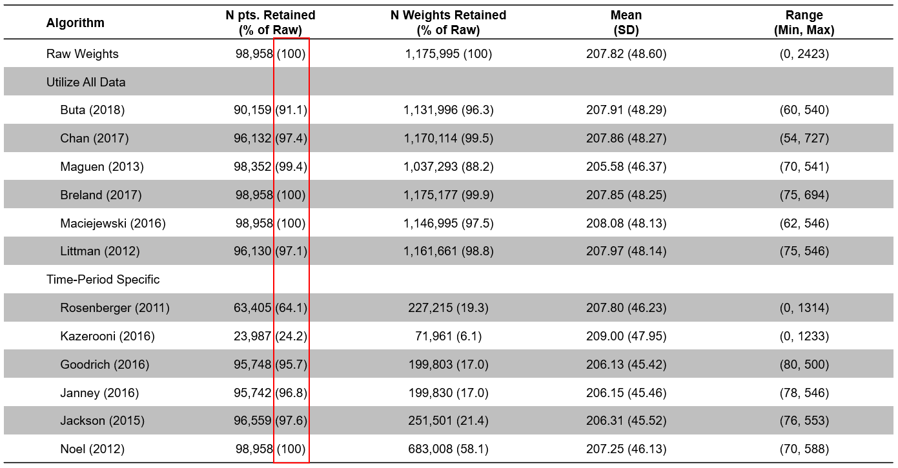
```

---
class: middle, center

### Varying Number of Weights Retained

```{r, echo = FALSE, eval = TRUE, out.height = 453, out.width = 870}
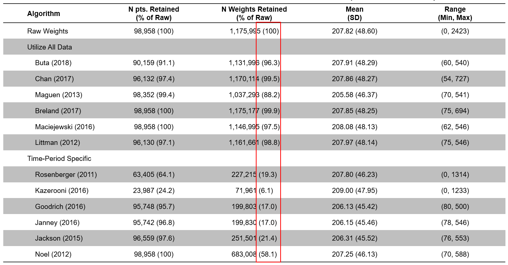
```

---
class: middle, center

### Mean (SD) do not change much

```{r, echo = FALSE, eval = TRUE, out.height = 453, out.width = 870}
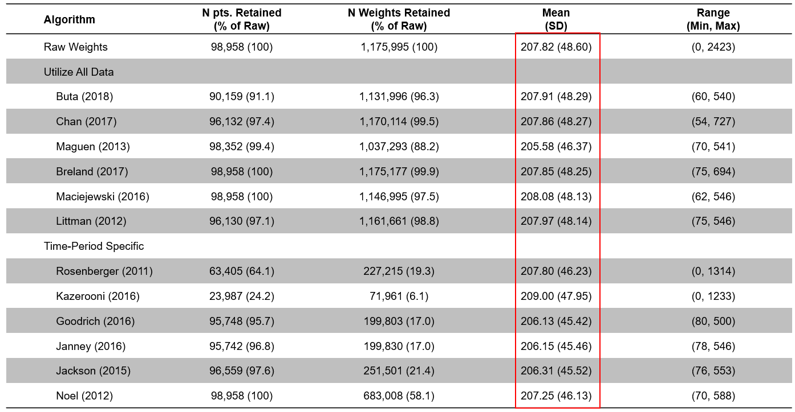
```

---
class: middle, center

### Mean (SD) do not change much

```{r, echo = FALSE, eval = TRUE, out.height = 453, out.width = 870}
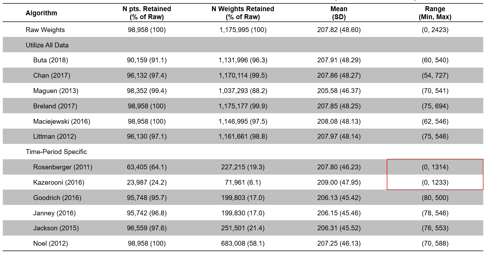
```

Because this is a large sample!

---
class: middle, center

Bootstrapped 95% CI of Sample Standard Deviation (SD)

```{r, echo = FALSE, eval = TRUE, out.height = 500}
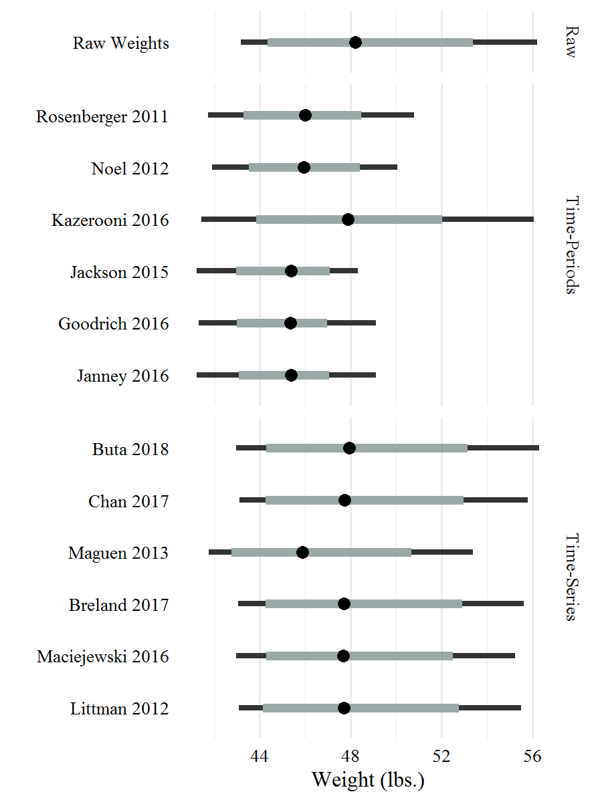
```

<font size="1">Mid-point represents the median SD; thick grey line represents the 80% quantile interval; black line represents the 95% quantile interval.</font>

---
class: middle, center

### Outliers still remain

```{r, echo = FALSE, eval = TRUE, out.height = 453, out.width = 870}

```

---
class: middle

## Descriptive Statistics

### Key Takeaways

.full-width[.content-box-blue[Despite cleaning efforts, implausible values remain in the data.]]

--

.full-width[.content-box-blue[For large cohorts of patients, the loss of data due to algorithm choice does not appreciably change the overall mean and variance.]]


---
class: middle

## Weight as a Predictor

.full-width[.content-box-blue[To compare algorithms in this context, we present an example showing the association between baseline weight and "new-onset" diabetes.]]

--

.full-width[.content-box-blue[
We excluded patients with diabetes prior to the study index date and we defined new-onset diabetes as the presence of two or more diabetes diagnosis codes after the patient's index date. 

We applied each of the 12 algorithms to create baseline weight measures for the patients in our four cohorts, using weight measurements that occurred during a 60-day window on or before the index date.

The resulting baseline weight measure was the measurement that occurred on the closest day to the index date.

We used separate logistic regression models to obtain odds ratios for the effect of patient weight on new-onset diabetes.
]]


---
class: middle, center

### Miniscule Differences in Odds Ratios

```{r, echo = FALSE, eval = TRUE, out.height = 548, out.width = 548}
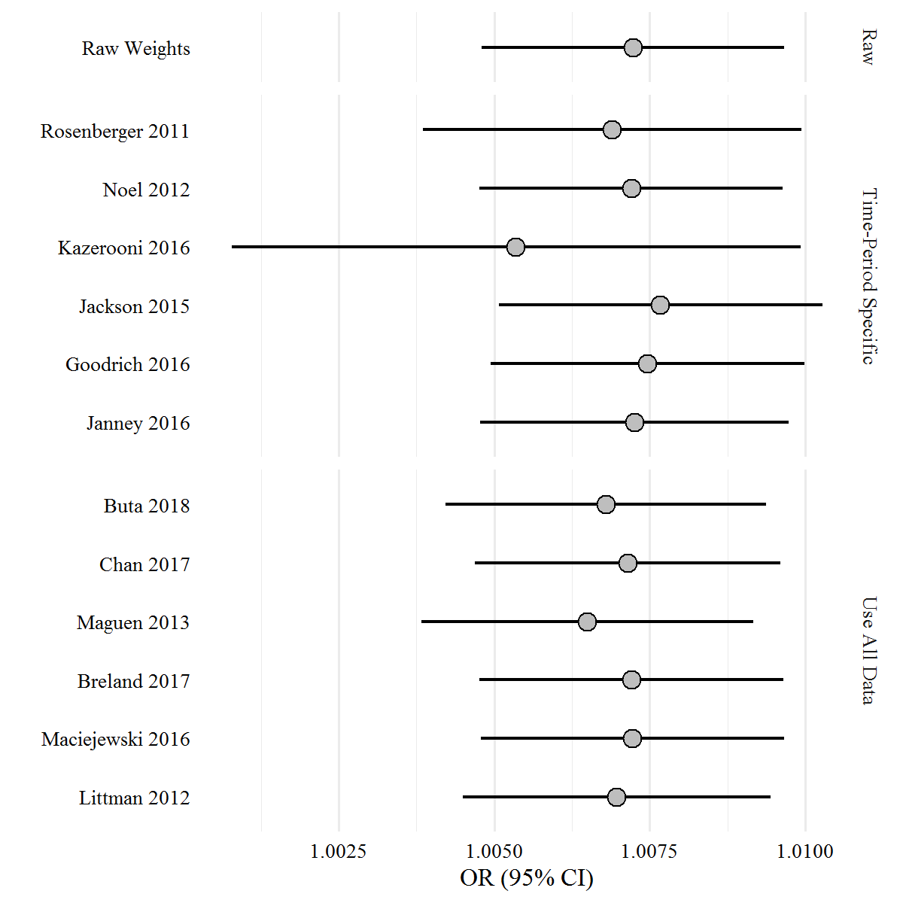
```

---
class: middle

## Weight as a Predictor

### Key Takeaways

.full-width[.content-box-blue[Relatively **small differences** in effect size.]]

--

.full-width[.content-box-blue[Across algorithms, 95% CIs overlap substantially; **however, some of the time-period specific algorithms show greater variation**.]]

---
class: middle

## Weight Change

.full-width[.content-box-blue[
A common metric used in weight loss studies involves one-year **weight loss** $\ge 5 \%$

Similarly, we examined $\ge 5 \%$ **weight gain**.

To compare algorithms on this metric, we applied each algorithm to our cohorts. 

We used a **60-day window** to definite initial weight values and included the weight measurement taken on the closest day to the index date. To define one-year follow-up weights, we again used a 60-day window around the date one year after baseline, keeping the closest weight measurement.
]]

---
class: middle, center

### Number of Patients Retained is Mostly Similar Across Algorithms

```{r, echo = FALSE, eval = TRUE, out.height = 453, out.width = 870}
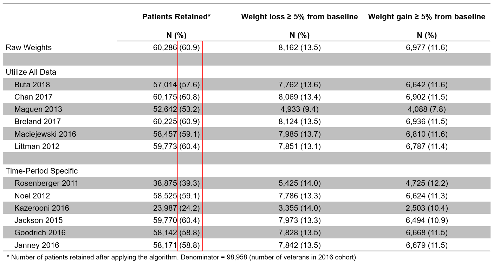
```

---
class: middle, center

### Weight Loss Proportions Similar Across Algorithms

```{r, echo = FALSE, eval = TRUE, out.height = 453, out.width = 870}
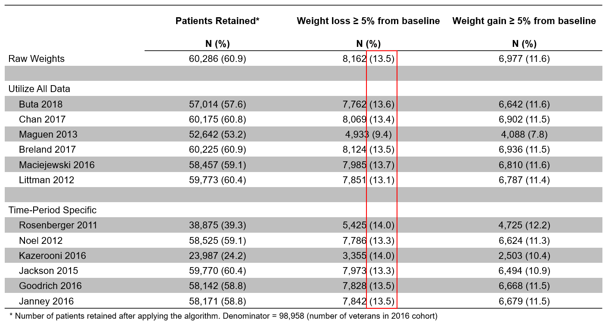
```

---
class: middle, center

### Same with Weight Gain ...

```{r, echo = FALSE, eval = TRUE, out.height = 453, out.width = 870}
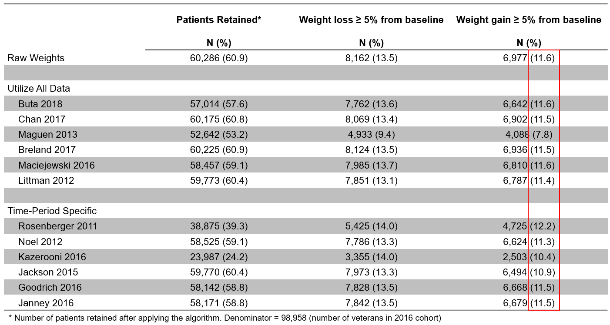
```

---
class: middle, center

### Implausible Weight Change Values

```{r, echo = FALSE, eval = TRUE, out.height = 453, out.width = 870}
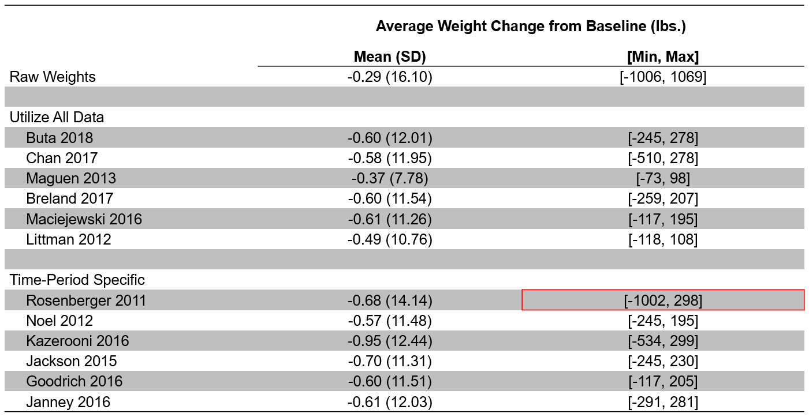
```

---
class: middle

## Weight Change

### Key Takeaways

.full-width[.content-box-blue[Weight gain and loss proportions are fairly **consistent** across algorithms.]]

--

.full-width[.content-box-blue[**Implausible values remain** even after applying a - possibly complicated - algorithm.]]

---
class: middle

## Longitudinal Weight Trajectories

.full-width[.content-box-blue[
Researchers may be interested in assessing **weight trajectories** within patient over time, and potentially **classifying patients** according to their trajectory, or examining whether types of patients respond differentially to interventions.

**Algorithm choice** may impact the trajectory of individuals and their measurements collected over time, especially for algorithms that severely reduce the number of measurements left to analyze.

Instead of aggregating patient weight over a specific time period, studies analyzing weight measures utilize **repeated measures designs**, such as (generalized) linear mixed models (LMM) or ANOVA/ANCOVAs for estimation. 

To compare algorithms in this context, we used a **latent class mixed model** that assumes the population is heterogeneous and composed of some selected number of latent classes characterized by specific trajectories.
]]

---
class: middle, center

### Time-Period Specific Algorithms Produce *Outlier* Trajectories

```{r, echo = FALSE, eval = TRUE, out.height = 531, out.width = 797}
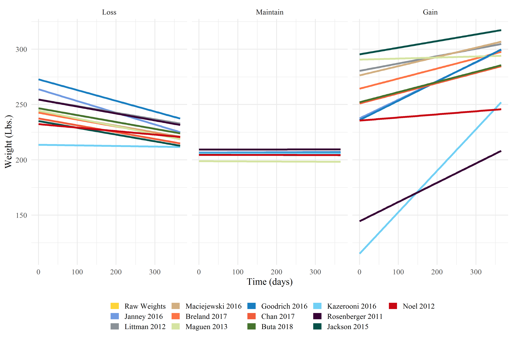
```

---
class: middle

## Longitudinal Weight Trajectories

### Key Takeaways

.full-width[.content-box-blue[Algorithms that **use all data** to clean weight measures appear to be more appropriate when analyzing longitudinal trajectories.]]

---
class: middle

## Facility-Level Measures

.full-width[.content-box-blue[
Researchers and evaluators are often interested in **comparing facilities** according to the percent of patients meeting a metric of interest.

We used the raw data and each of the 12 algorithms to calculate the percent of patients at each facility with:
  * **one-year weight loss** $\ge 5 \%$
  * **one-year weight gain** $\ge 5 \%$
  
Our objective was to understand the impact of algorithm choice on calculated facility level metrics therefore we examined **unadjusted facility rates**. 

We **rank ordered facilities** based on the percent of patients meeting each metric. 

Compared the differences in the facility level percent of patients based on each algorithm, grouping by those that use all data and time-period specific algorithms.
]]

---
class: center, middle

### More Data $=$ More Consistent Result

```{r, echo = FALSE, eval = TRUE, out.height = 455, out.width = 797}
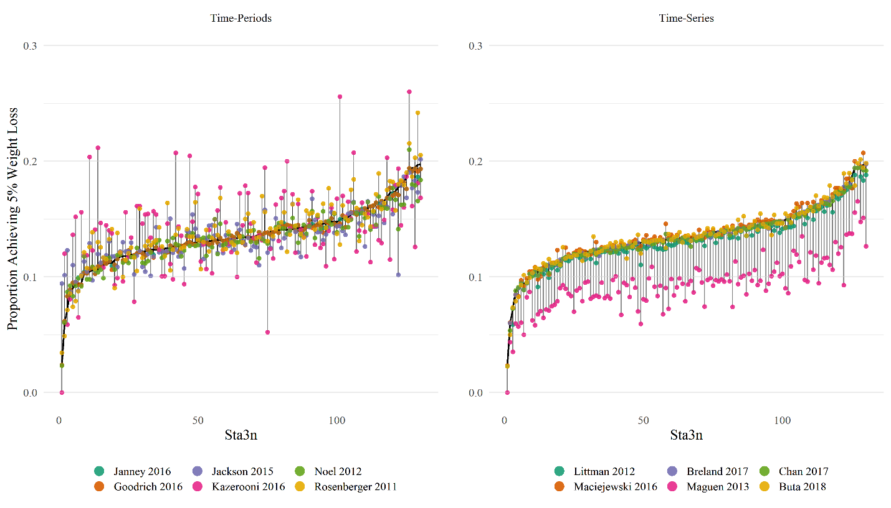
```

Facility-Level Percent of Patients w/ $\ge 5 \%$ Weight Loss by Algorithm.

---
class: middle

## Facility-Level Measures

### Key Takeaways

.full-width[.content-box-blue[With some exceptions, algorithms **using all data** exhibit less variation in measurement.
]]

---
class: middle, center, inverse

# Findings & Recommendations

---
class: middle

## Principal Findings

.full-width[.content-box-blue[Differences between algorithms are minor, implying that for many studies, a simpler algorithm design may be computationally more efficient.]]

--

.full-width[.content-box-blue[In some cases, the results are not different than using raw, unprocessed data, despite algorithm complexity.]]

---
class: middle

## Recommendations

.full-width[.content-box-blue[Studies using **point estimates of weight** and weight change may benefit from a **simple cleaning rule** based on cut-offs of implausible values.]]

--

.full-width[.content-box-blue[For **trajectory analyses**, time-period specific algorithms may not be appropriate.]]

--

.full-width[.content-box-blue[For **facility-level measures**, all time-period specific algorithms result in inconsistent results compared to algorithms that use all data.]]

---
class: middle

## Recommendations (Cont.)

### Example

.full-width[.content-box-blue[As an example of a recommendation: based on preliminary findings, we employed a two-stage algorithm to derive and clean a weight outcome for Miech et al. 2021, specifically >= 5% weight loss in a 1-year time frame.]]

--

.full-width[.content-box-blue[The procedure we used: for each patient in the VA derived cohort, all weight data was collected between a patient's "baseline" time-point and the end of follow-up (one year).]]

--

.full-width[.content-box-blue[To clean the data, the Breland *et al.* algorithm was employed as it **uses all data**, shows **consistent results** in comparison with other algorithms that use all data, and provides a **reasonable distribution** of weight values upon computing weight change.]]

---
class: middle

## Recommendations (Cont.)

### Example (Cont.)

.full-width[.content-box-blue[Once cleaned with the Breland algorithm, weight change and weight change as a percent of body weight were calculated and implausible values left in this distribution were then assessed iteratively, by choosing the next closest measurement to either the baseline or follow-up weight, then re-examining the weight change distribution.]] 

--

.full-width[.content-box-blue[This process ends when the distribution is removed of all implausible values, given a range chosen by study investigators.]]

---
class: middle

## Recommendations (Cont.)

.full-width[.content-box-blue[Finally, we recommend including detailed information on how measures are constructed in publications and/or share code via open source repositories.]]

---
class: middle, center, inverse

# Works in Progress

---
class: middle

## Effect on Sub-Populations (Race/Ethnicity)

```{r, echo = FALSE, eval = TRUE, out.height = 483, out.width = 725}
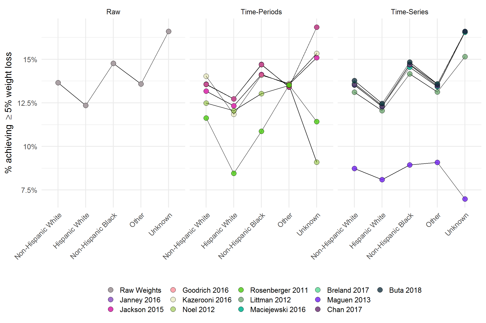
```

---
class: middle

## Manuscript

Submitted to *Journal of Medical Informatics* as **Deriving Weight from Big Data: A Comparison of Body Weight Measurement Cleaning Algorithms** on Sept. 30th (2nd round)

---
class: center, middle

# Thanks!

Slides created via the R package [**xaringan**](https://github.com/yihui/xaringan).

---
class: center, middle, inverse

# Questions?
